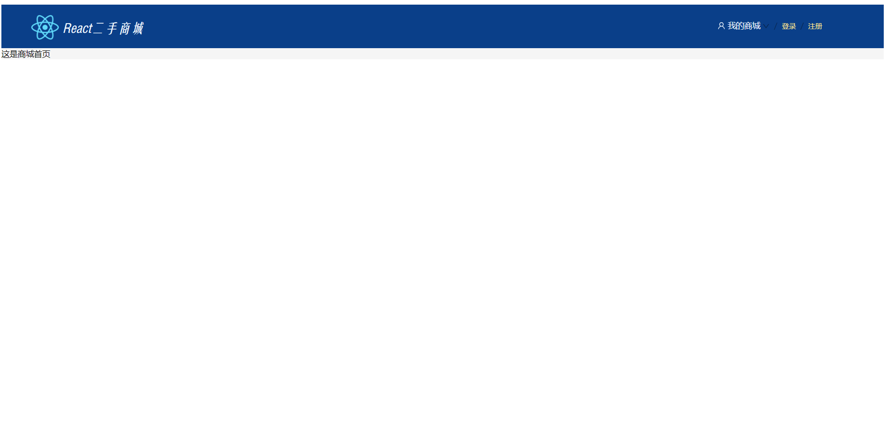
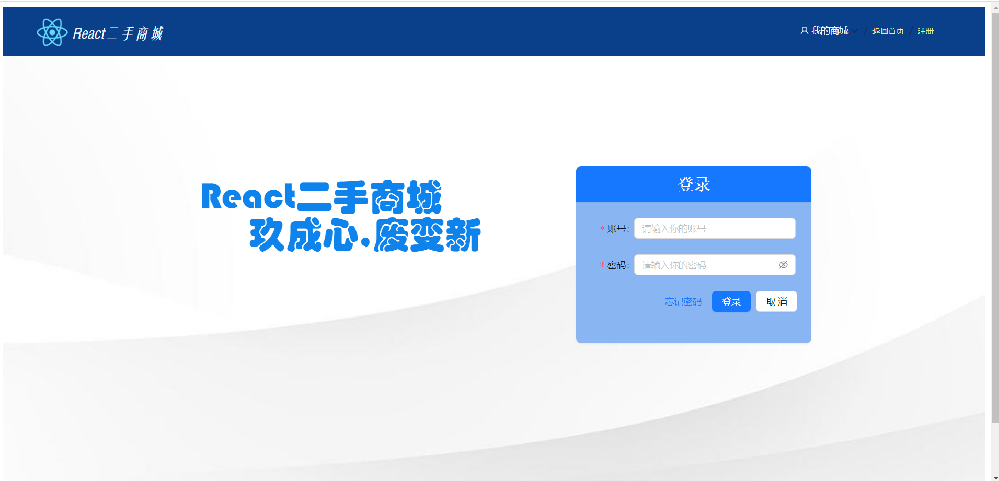

## 总体介绍

二手商城项目 

- 前端：React+AntDesign UI
- 后端：Spring
- 数据库：MySQL、Redis 

## 一、文件说明

1、graudatein-project为前端代码:需要用node.js安装React脚手架依赖、js-cookies、Axios 等依赖

- 带有older后缀的文件为 ``react-router-dom``时的前端工程文件，如果要用使用，将现有的compoents和pages文件删除，然后将带有older后缀文件重命--将 "_older" 删除；最后将package.json的 react-router-dom降至5，重新下载依赖即可运行
- 现在compoent和pages文件还在改造中，不能实现功能,older版用的是类式组件；新文件使用函数式组件，并重新整理项目前端的文件结构

2、graduation-project为后端代码：用需要按钮对应的Maven仓库，下载对应的依赖

3、CreateTableSql为Mysql相关表的建表语句，按顺序执行sql文件

## 二、环境要求

```
jdk:1.8.0_202
npm:8.15.0
yarn:1.22.19
Mysql:8.0.31
Reids:Windwo版 5.0.14.1
```

## 三、项目展示

说明：函数式组件改造中未完成，只能展示部分功能，未改造前的效果可看视频，该项目原本是作者的毕设项目，使用前端使用类式组件开发，现在正在改造成使用函数组件进行开发，并支持react-router  v6。视频做了消音与部分剪辑处理，请见谅

首页展示




登录界面展式



